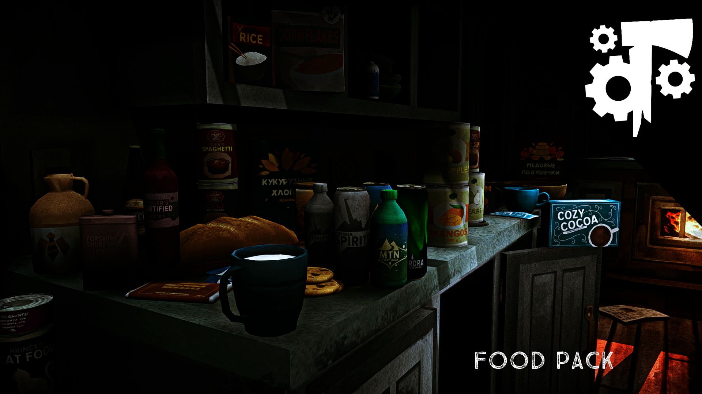
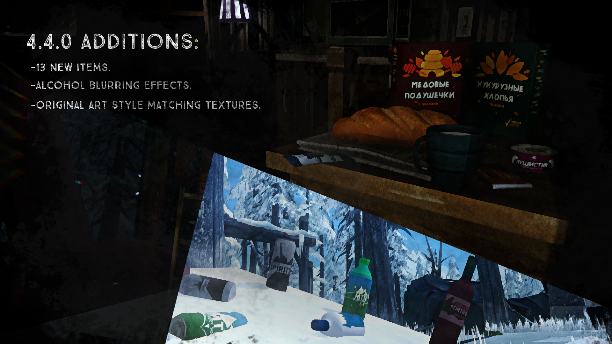

# Food-Pack

This is a mod for **The Long Dark** by Hinterland Studio, Inc.

Please see the [wiki](https://github.com/ds5678/Food-Pack/wiki) for details.

## Special Thanks

[WulfMarius](https://github.com/WulfMarius) is the original creator of many items in the Food Pack. I am very grateful for all the contributions he made to the modding community, and I'm honored to have adopted so many of his mods.

## [Patreon](https://www.patreon.com/ds5678)

I know many people might skip over this, but I hope you don't. You are so special, and I would appreciate your support. Modding takes lots of time, and I have expenses like food, internet, and rent. If you feel that I have improved your playing experience, please consider supporting me on my [Patreon](https://www.patreon.com/ds5678). Your support helps to ensure that I can continue making mods for you at the pace I am :)

## Localizations

You can help make the Food Pack even better by contributing to its localized text entries!

Here is a list of the [Localizations](https://github.com/ds5678/ModComponent/wiki/Localizations) currently supported by The Long Dark.

Here is the [localization file](https://github.com/ds5678/Food-Pack/blob/master/Unity/Assets/Localization.json) for the Food Pack.

If you send me your translations, I'll update and add them to the mod so that more people can enjoy it in their native language.

## Installation

1. If you haven't done so already, install MelonLoader by downloading and running [MelonLoader.Installer.exe](https://github.com/HerpDerpinstine/MelonLoader/releases/latest/download/MelonLoader.Installer.exe)
2. If you haven't done so already, install the latest version of [ModComponent](https://github.com/ds5678/ModComponent/releases/latest). Be sure to have all needed dependencies installed aswell: [GearSpawner](https://github.com/ds5678/GearSpawner/releases/latest), [LocalizationUtilities](https://github.com/ds5678/LocalizationUtilities/releases/latest) and [CraftingRevisions](https://github.com/ds5678/CraftingRevisions/releases/latest). You'll also want to install [AlcoholMod](https://github.com/ds5678/AlcoholMod/releases/latest) if you want alcohol to have effect.
3. If you haven't done so already, install the latest version of [ModSettings](https://github.com/zeobviouslyfakeacc/ModSettings/releases/latest).
4. Finally, download latest release of [Food-Pack](https://github.com/ds5678/Food-Pack/releases/latest) and install it by dropping directly into the `.../Mods/` folder.

## 4.4 Additions

